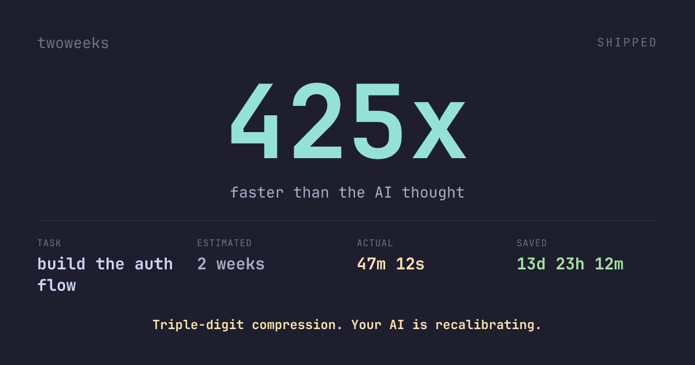

# twoweeks

[](https://github.com/Meliwat/twoweeks/actions/workflows/test.yml)
[](LICENSE)
[](https://nodejs.org)
[](https://github.com/Meliwat/twoweeks/stargazers)

> Time the gap between your AI's confident estimate and your actual ship time. Get a shareable brag card.

A tiny CLI that captures your AI's time estimate, measures how long you actually took, and produces a 1200×630 PNG you can drop straight into a tweet. Local-only — one JSON file, no cloud, no accounts, no telemetry.


## Install

```bash
# Homebrew (macOS / Linux)
brew install Meliwat/twoweeks/twoweeks

# From source (Node 18+)
git clone https://github.com/Meliwat/twoweeks
cd twoweeks && npm install && npm link
```

## Two ways to use it

### 1. Zero-touch (Claude Code users)

Install the hook once:

```bash
twoweeks install-hook
```

Now the next time Claude says *"about 2 weeks of focused work"* or *"weeks 1–6: implementation"*, twoweeks parses the estimate out of the response and starts the timer in the background. No typing. Ship when you're done:

```bash
twoweeks ship
```

That prints the brag card and tells you the one-liner to post it to 𝕏.

To remove: `twoweeks uninstall-hook`.

### 2. Manual

```bash
twoweeks "build the auth flow" "2 weeks"     # AI said this would take 2 weeks
# ... go build ...
twoweeks ship --share --screenshot --copy    # ship + open 𝕏 + PNG on clipboard
```

Pipe text from any other AI tool (Cursor, ChatGPT, Codex) into the same parser:

```bash
echo "$AI_RESPONSE" | twoweeks watch
```

## What you get

```
🎯 SHIPPED
──────────────────────────────────────────
Task:        build the auth flow
Estimated:   2 weeks
Actual:      47m 12s
Compression: 428x faster than the AI thought
Saved:       +13d 23h 12m
──────────────────────────────────────────

🎯 Triple-digit compression.

→ Tweet it:  twoweeks share 1
  Save PNG:  twoweeks ship --screenshot --copy
```

The PNG is 1200×630 (Open Graph dimensions). One command and it's on your clipboard, ready to paste into a 𝕏 / Bluesky / Mastodon compose box:



## Sharing

```bash
twoweeks ship --share                  # open 𝕏 with brag pre-filled
twoweeks ship --share --to-bluesky     # ... or Bluesky
twoweeks ship --share --to-mastodon    # ... or Mastodon
twoweeks share 1                       # share any shipped session by id
twoweeks ship --share --print          # print URL instead of opening browser
```

Every share rotates through 5 text variants so consecutive brags don't read as duplicates to ranking algorithms.

You can add a quote and a challenge:

```bash
twoweeks "ship the migration" "3 months" --quote "About 3 months of careful work."
twoweeks share 2 --challenge "@yourrival"
```

## Commands

| Command | What it does |
|---|---|
| `twoweeks install-hook` | Install the Claude Code Stop hook |
| `twoweeks uninstall-hook` | Remove it |
| `twoweeks watch` | Read text from stdin, capture an estimate |
| `twoweeks "task" "<eta>"` | Manually start a timer |
| `twoweeks` | Show active sessions |
| `twoweeks ship` | Close the timer, print the brag card |
| `twoweeks ship --share` | Ship + open 𝕏 with brag pre-filled |
| `twoweeks ship --screenshot` | Ship + save a 1200×630 PNG |
| `twoweeks ship --screenshot --copy` | Save PNG and copy it to clipboard (macOS) |
| `twoweeks screenshot [id]` | Render a PNG for a shipped session |
| `twoweeks share [id]` | Open 𝕏 with brag for a shipped session |
| `twoweeks history` | Shipped sessions + lifetime stats + achievements |
| `twoweeks abandon` | Abandon the current session |

## Flags

| Flag | What it does |
|---|---|
| `--eta "3 months"` | Provide AI estimate via flag instead of positional |
| `--quote "exact AI words"` | Verbatim AI quote rendered on the brag card |
| `--challenge "@handle"` | Append a callout to the share text |
| `--force` | Start a new session even if one is already active |
| `--to-bluesky` / `--to-mastodon` | Share to Bluesky / Mastodon instead of 𝕏 |
| `--print` | Print the share URL instead of opening the browser |
| `--screenshot` | (on `ship`) Save a PNG of the brag card |
| `--copy` | (on `ship --screenshot`) Copy the PNG to clipboard (macOS) |
| `--out <path>` | Output path for the `screenshot` command |
| `--open` | (on `screenshot`) Open the PNG after saving |
| `--plain` | Plain text (no colors / box drawing / emoji) |
| `--no-color` | Disable ANSI colors (also respects `NO_COLOR=1`) |
| `--no-emoji` | Strip emoji (also respects `TWOWEEKS_NO_EMOJI=1`) |
| `--json` | Machine-readable JSON output |
| `--quiet` | (on `watch`) Silent on no-match — for hook mode |
| `--help, -h` | Show help |
| `--version, -v` | Show version |

## Auto-capture parser

When the hook fires (or you pipe text into `twoweeks watch`), the parser scans for plan-shaped estimate phrases:

- `"2 weeks"`, `"about three months"`, `"roughly an hour"`, `"around 5 days of focused work"`
- `"weeks 1-6"`, `"days 1 through 10"`, `"weeks 2 to 8"` — the upper bound wins
- `"by end of week 4"`

The **biggest** estimate found in the response wins (assumption: the AI is naming the outer time window, not the substeps). The matched phrase is captured verbatim and rendered as a quote on the brag card. First-write-wins: if a session is already active, repeated hook fires are no-ops.

## Milestones

`twoweeks ship` prints a milestone line based on your compression ratio:

| Ratio | Milestone |
|---|---|
| ∞ (instant) | Submit this to Nature. |
| ≥ 1,000,000x | Million-x compression. Frame it. |
| ≥ 100,000x | Six-figure compression. |
| ≥ 10,000x | Five-figure compression. |
| ≥ 1,000x | Four-figure compression. |
| ≥ 100x | Triple-digit compression. |
| ≥ 10x | Double-digit compression. |
| ≥ 1x | Within a hair of the estimate. |
| < 1x | Slower than estimated. |

## Achievements

`twoweeks history` tracks 7 achievements:

- **First Ship** / **Hat Trick** / **Marathon** (1, 3, 10 ships)
- **100x Club** / **1000x Club** / **Million-x Club** (compression milestones)
- **Streak: 3 days** (consecutive shipping days)

## Accessibility

- `--plain` strips ANSI, box drawing, and emoji — screen reader, SSH-no-unicode, and CI-log friendly.
- `--no-color` disables colors only. `--no-emoji` strips emoji only.
- Brag PNGs ship with a `.alt.txt` sidecar containing the same content in plain text — paste it as alt text when sharing.
- The Saved/Cost line uses `+`/`-` prefixes so over-budget vs under-budget reads correctly without color.
- `--json` includes `actual_spoken` ("47 minutes 12 seconds") alongside `actual_human` ("47m 12s").

## Scripting

Every command supports `--json`:

```bash
$ twoweeks ship --json | jq '.ratio_formatted'
"428x"

$ twoweeks history --json | jq '.stats.bestRatio'
1247.34

$ twoweeks --json | jq '.active[].task'
"build the auth flow"
```

## Storage

Local JSON at `~/.twoweeks/history.json`. PNG brag cards at `~/.twoweeks/screenshots/`. Override with `TWOWEEKS_HOME=/somewhere/else`.

## Troubleshooting

**`twoweeks: command not found`** — `npm link` couldn't add the binary to your PATH. Re-run `npm link`, check that `$(npm prefix -g)/bin` is in PATH, or invoke directly: `node $(pwd)/dist/cli.js`.

**`Error: missing AI estimate`** — Pass the AI's estimate as the second argument: `twoweeks "task" "2 weeks"`. Or install the hook with `twoweeks install-hook` to capture it automatically.

**Box-drawing characters render as `?` or boxes** — Your terminal lacks Unicode support. Use `--plain` for ASCII output.

**Emoji render as boxes** — Use `--no-emoji` or set `TWOWEEKS_NO_EMOJI=1`.

**`brew install` fails** — Use the full form: `brew install Meliwat/twoweeks/twoweeks`.

**Wipe history** — `rm -rf ~/.twoweeks`.

## Development

```bash
bun install
bun run cli "task" "2 weeks"
bun test               # 74 tests
bun run build          # dist/cli.js (Node-compatible)
```

## License

MIT.
